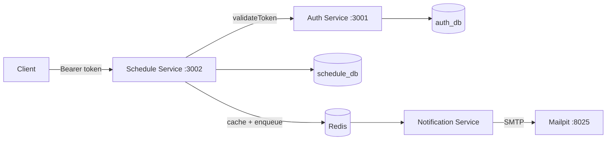

# Healthcare Scheduling System

Microservice-based clinic scheduling (NestJS, GraphQL, Prisma, PostgreSQL, Docker).

## Architecture

## Quick start
1. `cp .env.example .env` lalu isi nilainya
2. `docker compose up -d --build`
3. Playground: http://localhost:3001/graphql dan http://localhost:3002/graphql
4. Email inbox (dev): http://localhost:8025
5. E2E: `node --test e2e/healthcare.e2e.test.mjs`

## Environment variables
| Variable | Service | Default | Description |
|---|---|---|---|
| POSTGRES_USER / POSTGRES_PASSWORD | postgres | (required) | DB credentials (URL-safe) |
| JWT_SECRET | auth | (required) | JWT signing secret |
| JWT_EXPIRES_IN_SECONDS | auth | 3600 | Token lifetime |
| AUTH_SERVICE_URL | schedule | http://auth-service:3001/graphql | Token validation endpoint |
| REDIS_HOST / REDIS_PORT | schedule, notification | redis / 6379 | Cache & queue |
| SCHEDULE_SLOT_MINUTES | schedule | 30 | Consultation slot length for conflict check |
| SMTP_HOST / SMTP_PORT / MAIL_FROM | notification | mailpit / 1025 | Email delivery |

## Design decisions & assumptions
- **Conflict rule**: no duration in spec → fixed slot (`SCHEDULE_SLOT_MINUTES`). Enforced with a per-doctor Postgres advisory lock + unique `(doctorId, scheduledAt)`.
- **Database per service** (one Postgres instance, separate databases).
- **Token validation** result cached in Redis ≤ 60s (hashed key). Tradeoff: revocation delay up to 60s.
- **Delete restrictions**: customers/doctors with schedules cannot be deleted.
- **Known limitation**: email enqueue happens after commit; production would use the transactional outbox pattern.

## Example operations
(register → login → set header `{"Authorization": "Bearer <token>"}` → createCustomer → createDoctor → createSchedule → schedules)