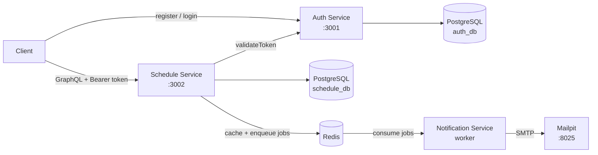
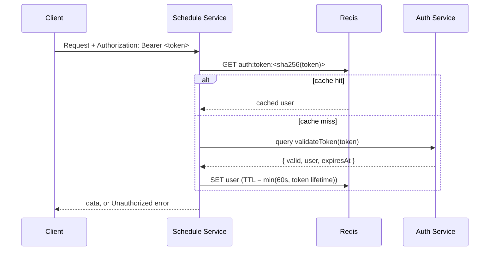
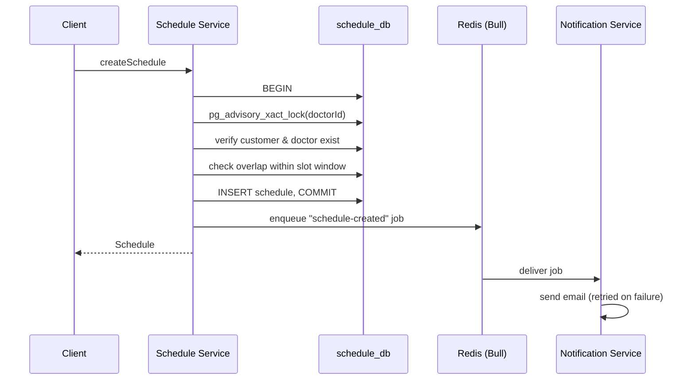

# Healthcare Scheduling System

A microservice-based backend that lets a clinic manage consultation schedules between doctors and patients. Built with NestJS, GraphQL, Prisma, and PostgreSQL, fully containerized with Docker Compose.

## Table of Contents

- [Tech Stack](#tech-stack)
- [Features](#features)
- [Architecture](#architecture)
- [Project Structure](#project-structure)
- [Getting Started](#getting-started)
- [Environment Variables](#environment-variables)
- [API Documentation](#api-documentation)
- [Example Queries & Mutations](#example-queries--mutations)
- [Business Rules & Design Decisions](#business-rules--design-decisions)
- [Testing](#testing)
- [Known Limitations](#known-limitations)
- [Troubleshooting](#troubleshooting)

## Tech Stack

| Component | Technology |
|---|---|
| Framework | NestJS |
| API | GraphQL (code-first, Apollo Server) |
| Database | PostgreSQL 16 |
| ORM | Prisma 6 |
| Cache & Queue | Redis 7 + Bull |
| Email (development) | Nodemailer + Mailpit |
| Container | Docker & Docker Compose |
| Testing | Jest |

## Features

### Core requirements

- **Auth Service** — `register`, `login` (JWT), `validateToken`; passwords hashed with bcrypt
- **Schedule Service** — Customer, Doctor, and Schedule modules with full CRUD as specified
- **Inter-service authentication** — every Schedule Service operation validates the bearer token by calling the Auth Service `validateToken` query
- **Schedule conflict prevention** — a doctor cannot have overlapping schedules
- **Referential validation** — customer and doctor must exist before a schedule is created
- **Pagination** on all list queries, plus filtering on `schedules`
- **One-command startup** with `docker compose up`

### Bonus features

| Feature | Implementation |
|---|---|
| Email Notification | Customer receives an email when a schedule is created or deleted |
| Queue System | Emails are sent asynchronously through a Bull queue with retries and exponential backoff |
| Caching | Redis caches token validation results and customer/doctor lookups by ID |
| Unit Testing | Jest unit tests in all three services, coverage threshold enforced at 50% |
| API Documentation | GraphQL Playground with descriptions on every type, field, and argument |

## Architecture



| Service | Responsibility | Owns |
|---|---|---|
| **auth-service** | User registration, login, token issuing and validation | `auth_db` |
| **schedule-service** | Customers, doctors, schedules; token validation via Auth Service; job producer | `schedule_db` |
| **notification-service** | Bull worker that consumes email jobs and sends emails over SMTP | — |

Each service owns its database (database-per-service pattern). Both databases run on a single PostgreSQL container to keep the local setup light, but no service can read another service's tables.

### Request authentication flow



### Schedule creation flow



## Project Structure

```
healthcare-scheduling/
├── docker-compose.yml
├── .env.example
├── docker/postgres/init.sql          # creates auth_db and schedule_db
├── auth-service/
│   ├── Dockerfile
│   ├── prisma/                       # schema + migrations
│   └── src/
│       ├── auth/                     # resolver, service, models, inputs, tests
│       ├── common/                   # GraphQL error formatter
│       └── prisma/                   # PrismaService
├── schedule-service/
│   ├── Dockerfile
│   ├── prisma/
│   └── src/
│       ├── auth-client/              # Auth Service client + global auth guard
│       ├── cache/                    # fail-open Redis cache
│       ├── common/                   # pagination, Prisma error mapping, error formatter
│       ├── customers/
│       ├── doctors/
│       ├── schedules/
│       ├── notifications/            # Bull queue producer
│       └── prisma/
└── notification-service/
    ├── Dockerfile
    └── src/
        ├── email.processor.ts        # Bull consumer
        ├── mailer.service.ts         # Nodemailer transport
        └── email-job.ts              # job contract
```

## Getting Started

### Prerequisites

- Docker Desktop (Docker Engine with Compose v2)
- Node.js 22 — only needed to run unit tests or services outside Docker

### Run with Docker

```bash
git clone https://github.com/Aizarrahima/healthcare-scheduling.git
cd healthcare-scheduling
cp .env.example .env          # then edit the values
docker compose up -d --build
```

Database migrations are applied automatically when the services start (`prisma migrate deploy`).

| Service | URL |
|---|---|
| Auth Service (GraphQL Playground) | http://localhost:3001/graphql |
| Schedule Service (GraphQL Playground) | http://localhost:3002/graphql |
| Mailpit (inbox for sent emails) | http://localhost:8025 |
| PostgreSQL (from host) | `localhost:5433` |
| Redis (from host) | `localhost:6379` |

> PostgreSQL is exposed on host port **5433** to avoid clashing with a local PostgreSQL on 5432. Containers still talk to it on `postgres:5432`.

Stop everything with `docker compose down`, or `docker compose down -v` to also delete the database volume.

### Run a service outside Docker (optional)

```bash
docker compose up -d postgres redis
cd auth-service
cp .env.example .env          # points to localhost:5433
npm install
npx prisma migrate deploy
npm run start:dev
```

Repeat for `schedule-service` (and optionally `notification-service`). Start the Auth Service first, since the Schedule Service depends on it to validate tokens.

## Environment Variables

### Root `.env` (used by Docker Compose)

| Variable | Required | Default | Description |
|---|---|---|---|
| `POSTGRES_USER` | yes | — | PostgreSQL user |
| `POSTGRES_PASSWORD` | yes | — | PostgreSQL password. Must be URL-safe (avoid `@ : / ? #`) because it is embedded in connection URLs |
| `JWT_SECRET` | yes | — | Secret used to sign JWTs. Generate with `openssl rand -hex 32` |
| `JWT_EXPIRES_IN_SECONDS` | no | `3600` | Access token lifetime |
| `SCHEDULE_SLOT_MINUTES` | no | `30` | Consultation slot length used for conflict detection |
| `MAIL_FROM` | no | `Healthcare Clinic <no-reply@clinic.local>` | Sender address for notification emails |

### Per-service variables (set by `docker-compose.yml`)

| Variable | Service | Description |
|---|---|---|
| `PORT` | auth, schedule | HTTP port (3001 / 3002) |
| `DATABASE_URL` | auth, schedule | PostgreSQL connection string for the service's own database |
| `AUTH_SERVICE_URL` | schedule | GraphQL endpoint of the Auth Service |
| `REDIS_HOST`, `REDIS_PORT` | schedule, notification | Redis connection for cache and queue |
| `SMTP_HOST`, `SMTP_PORT` | notification | SMTP server (Mailpit in development) |
| `SMTP_USER`, `SMTP_PASS`, `SMTP_SECURE` | notification | Optional, for a real SMTP provider |

No secrets are committed. `.env` files are git-ignored; only `.env.example` is tracked.

## API Documentation

Both services expose an interactive **GraphQL Playground**. Every type, field, argument, query, and mutation carries a description, browsable from the **Docs / Schema** tab on the right side of the Playground.

### Using the Playground with authentication

1. Open http://localhost:3001/graphql and run `register`, then `login`.
2. Copy `accessToken` from the login response.
3. Open http://localhost:3002/graphql and, in the **HTTP HEADERS** panel, add:

```json
{ "Authorization": "Bearer <accessToken>" }
```

All Schedule Service operations require this header.

### Auth Service — `http://localhost:3001/graphql`

| Operation | Type | Arguments | Returns | Description |
|---|---|---|---|---|
| `register` | Mutation | `input: RegisterInput!` | `User!` | Create an account; password hashed with bcrypt |
| `login` | Mutation | `input: LoginInput!` | `AuthPayload!` | Verify credentials and issue a JWT |
| `validateToken` | Query | `token: String!` | `TokenValidation!` | Validate a JWT and return the user; called by other services |

### Schedule Service — `http://localhost:3002/graphql` (auth required)

**Customers**

| Operation | Type | Arguments | Returns |
|---|---|---|---|
| `createCustomer` | Mutation | `input: CreateCustomerInput!` | `Customer!` |
| `updateCustomer` | Mutation | `id: ID!`, `input: UpdateCustomerInput!` | `Customer!` |
| `customers` | Query | `page: Int = 1`, `limit: Int = 10` | `PaginatedCustomers!` |
| `customer` | Query | `id: ID!` | `Customer!` |
| `deleteCustomer` | Mutation | `id: ID!` | `Customer!` |

**Doctors**

| Operation | Type | Arguments | Returns |
|---|---|---|---|
| `createDoctor` | Mutation | `input: CreateDoctorInput!` | `Doctor!` |
| `updateDoctor` | Mutation | `id: ID!`, `input: UpdateDoctorInput!` | `Doctor!` |
| `doctors` | Query | `page: Int = 1`, `limit: Int = 10` | `PaginatedDoctors!` |
| `doctor` | Query | `id: ID!` | `Doctor!` |
| `deleteDoctor` | Mutation | `id: ID!` | `Doctor!` |

**Schedules**

| Operation | Type | Arguments | Returns |
|---|---|---|---|
| `createSchedule` | Mutation | `input: CreateScheduleInput!` | `Schedule!` |
| `schedules` | Query | `page`, `limit`, `doctorId`, `customerId`, `from`, `to` (all optional) | `PaginatedSchedules!` |
| `schedule` | Query | `id: ID!` | `Schedule!` |
| `deleteSchedule` | Mutation | `id: ID!` | `Schedule!` |

### Pagination & filtering

List queries return `{ items, pageInfo }`, where `pageInfo` contains `total`, `page`, `limit`, `totalPages`, and `hasNextPage`. `limit` is capped at 100.

`schedules` can be filtered by `doctorId`, `customerId`, and a time range (`from`/`to`, inclusive). Results are ordered by `scheduledAt` ascending.

### Errors

Errors follow the GraphQL format (`errors[].message`). Stack traces are never returned to clients.

| Scenario | Example message |
|---|---|
| Missing `Authorization` header | `Missing bearer token` |
| Invalid or expired token | `Invalid or expired token` |
| Auth Service unreachable | `Authentication service unavailable` |
| Invalid input | `email must be an email` |
| Malformed UUID argument | `Validation failed (uuid is expected)` |
| Wrong login credentials | `Invalid email or password` |
| Email already registered | `Email is already registered` |
| Resource not found | `Customer <id> not found` |
| Doctor already booked | `Doctor already has a schedule at <time> (slot duration 30 minutes)` |
| Schedule in the past | `scheduledAt must be in the future` |
| Deleting a customer/doctor that still has schedules | `Customer still has 2 schedule(s); delete them first` |

## Example Queries & Mutations

### 1. Register — Auth Service

```graphql
mutation Register($input: RegisterInput!) {
  register(input: $input) { id email createdAt }
}
```

```json
{ "input": { "email": "admin@clinic.local", "password": "Secret123!" } }
```

### 2. Login — Auth Service

```graphql
mutation Login($input: LoginInput!) {
  login(input: $input) { accessToken tokenType expiresIn user { id email } }
}
```

```json
{ "input": { "email": "admin@clinic.local", "password": "Secret123!" } }
```

### 3. Validate token — Auth Service

```graphql
query ValidateToken($token: String!) {
  validateToken(token: $token) { valid expiresAt user { id email } }
}
```

```json
{ "token": "<accessToken>" }
```

> All following operations run on the Schedule Service with header `{ "Authorization": "Bearer <accessToken>" }`.

### 4. Create customer

```graphql
mutation CreateCustomer($input: CreateCustomerInput!) {
  createCustomer(input: $input) { id name email }
}
```

```json
{ "input": { "name": "Budi Santoso", "email": "budi@example.com" } }
```

### 5. Update customer

```graphql
mutation UpdateCustomer($id: ID!, $input: UpdateCustomerInput!) {
  updateCustomer(id: $id, input: $input) { id name email updatedAt }
}
```

```json
{ "id": "<customerId>", "input": { "name": "Budi S." } }
```

### 6. List customers

```graphql
query Customers($page: Int!, $limit: Int!) {
  customers(page: $page, limit: $limit) {
    items { id name email }
    pageInfo { total page limit totalPages hasNextPage }
  }
}
```

```json
{ "page": 1, "limit": 10 }
```

### 7. Create doctor

```graphql
mutation CreateDoctor($input: CreateDoctorInput!) {
  createDoctor(input: $input) { id name }
}
```

```json
{ "input": { "name": "dr. Sari, Sp.PD" } }
```

### 8. Create schedule

```graphql
mutation CreateSchedule($input: CreateScheduleInput!) {
  createSchedule(input: $input) {
    id objective scheduledAt
    customer { name email }
    doctor { name }
  }
}
```

```json
{
  "input": {
    "objective": "General consultation",
    "customerId": "<customerId>",
    "doctorId": "<doctorId>",
    "scheduledAt": "2026-10-20T03:00:00.000Z"
  }
}
```

A confirmation email appears in Mailpit (http://localhost:8025) a moment later. Running the same mutation again returns a conflict error.

### 9. List schedules with filters

```graphql
query Schedules($doctorId: ID, $from: DateTime, $to: DateTime, $page: Int!, $limit: Int!) {
  schedules(doctorId: $doctorId, from: $from, to: $to, page: $page, limit: $limit) {
    items { id objective scheduledAt customer { name } doctor { name } }
    pageInfo { total page totalPages hasNextPage }
  }
}
```

```json
{
  "doctorId": "<doctorId>",
  "from": "2026-10-01T00:00:00.000Z",
  "to": "2026-10-31T23:59:59.000Z",
  "page": 1,
  "limit": 10
}
```

### 10. Get & delete schedule

```graphql
query Schedule($id: ID!) {
  schedule(id: $id) { id objective scheduledAt customer { name } doctor { name } }
}

mutation DeleteSchedule($id: ID!) {
  deleteSchedule(id: $id) { id }
}
```

```json
{ "id": "<scheduleId>" }
```

Deleting a schedule sends a cancellation email to the customer.

## Business Rules & Design Decisions

**Schedule conflict rule.** The specification defines a conflict as "the same doctor at the same time" but gives schedules no duration. Matching exact timestamps only would let 10:00 and 10:01 both pass, so each consultation is treated as a fixed slot of `SCHEDULE_SLOT_MINUTES` (default 30). A new schedule conflicts if another schedule for the same doctor starts less than one slot before or after it.

**Race-condition safety.** Conflict checking and insertion run in one transaction guarded by a PostgreSQL advisory lock keyed on the doctor ID. Two concurrent requests for the same doctor therefore cannot both pass the overlap check. A unique constraint on `(doctorId, scheduledAt)` is kept as a last line of defence.

**Database per service.** The Auth and Schedule services use separate databases, so customers (patients) and users (API accounts) are intentionally separate concepts.

**Token validation caching.** Calling the Auth Service on every request adds latency and makes it a single point of failure. Validated tokens are cached in Redis under a SHA-256 hash of the token (raw tokens are never stored) for at most 60 seconds, and never beyond the token's own expiry.

**Fail-open cache.** If Redis is unavailable, cache reads behave as misses and requests continue against the database instead of failing.

**Delete restrictions.** Customers and doctors that still have schedules cannot be deleted. Cascading would silently erase consultation history and skip cancellation emails.

**Asynchronous notifications.** Schedule Service only enqueues jobs. The Notification Service sends emails with up to 5 attempts and exponential backoff. Enqueue failures are logged but never fail the user's request, since the schedule is already committed.

**Timezones.** Times are stored as `timestamptz` in UTC. Notification emails render times in `Asia/Jakarta` (WIB).

## Testing

```bash
cd auth-service && npm run test:cov
cd schedule-service && npm run test:cov
cd notification-service && npm run test:cov
```

| Service | Line coverage |
|---|---|
| auth-service | 86.9% |
| schedule-service | 84.75% |
| notification-service | 100% |

Coverage excludes only bootstrap files (`main.ts`, `*.module.ts`). A 50% line/statement threshold is enforced in each service's `jest.config.ts`.

Key behaviours under test include password hashing and timing-safe login, token validation edge cases, schedule overlap detection and slot window boundaries, Prisma error mapping (duplicate, not found), delete restrictions, cache hit/miss and fail-open behaviour, and email job retry semantics.

## Known Limitations

- **Notification delivery is not transactional.** A crash between committing a schedule and enqueuing its job loses that email. A production system would use the transactional outbox pattern.
- **Token revocation delay.** Because validation results are cached, a revoked token can remain usable for up to 60 seconds. There is no revocation mechanism yet.
- **Fixed slot duration.** All consultations share one configurable length; per-doctor or per-appointment durations are not modelled.
- **No `updateSchedule`.** Not part of the specification; rescheduling is done by deleting and recreating.
- **Offset pagination.** Simple and sufficient here; cursor pagination would scale better for large datasets.
- **Migrations run on startup.** Fine for a single instance; with multiple replicas, migrations should run as a separate deployment step.
- **Job contract is duplicated** between the Schedule and Notification services; a shared package would prevent drift.

## Troubleshooting

| Problem | Fix |
|---|---|
| `database "auth_db" does not exist` | `init.sql` only runs on a fresh volume. Run `docker compose down -v` and start again |
| Prisma cannot connect from host | Use port `5433`, not `5432` |
| `npm ci` fails with `ECONNRESET` during build | Transient network error; rerun, or build services one at a time with `docker compose build <service>` |
| `Authentication service unavailable` | Check `docker compose logs auth-service` |
| No email in Mailpit | Check `docker compose logs notification-service` |